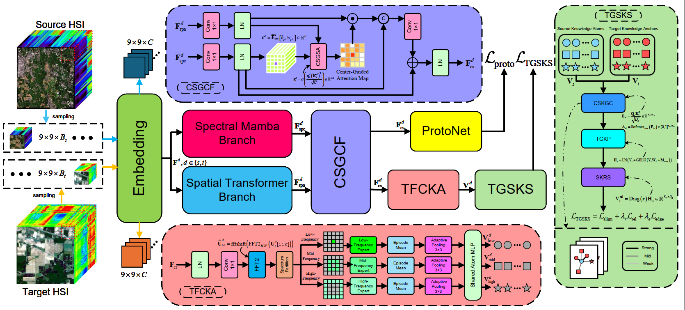

# TASKS-Net

Official repository for **"NOT ALL SOURCE KNOWLEDGE TRANSFERS ACROSS SCENES: TARGET-GUIDED RELIABILITY LEARNING AND SELECTION FOR FEW-SHOT HYPERSPECTRAL IMAGE CLASSIFICATION" [ICASSP 2027]**.

Both the **code** and the **dataset** will be released **after paper acceptance**.

---

## 🌍 The overall framework of TASKS-Net   [2026.09 Updated]

---
